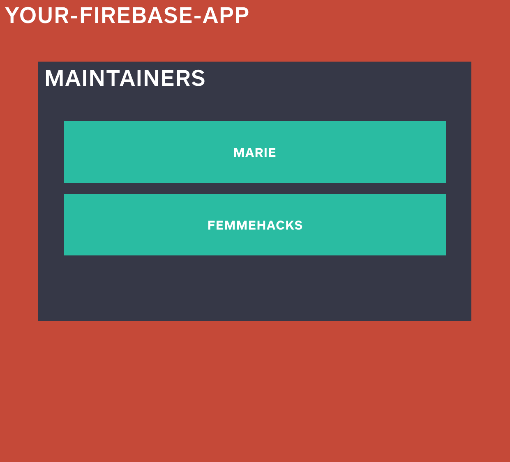
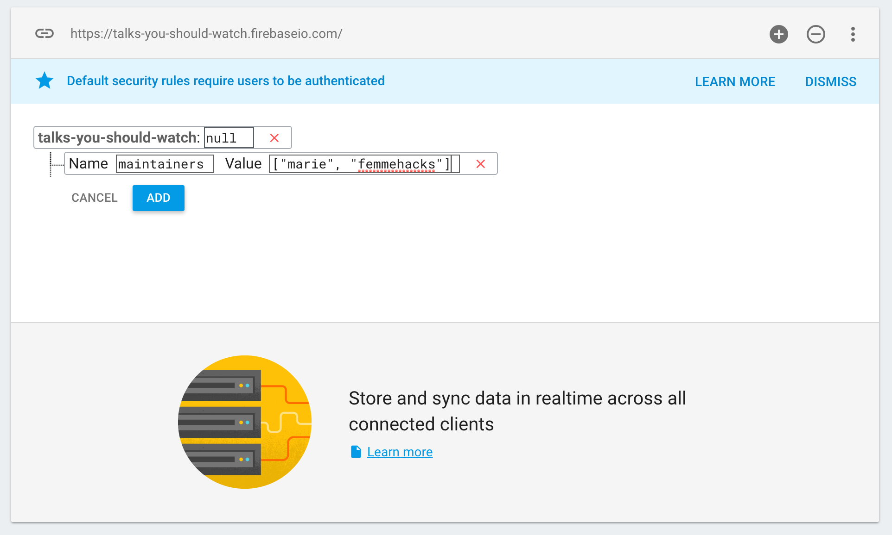
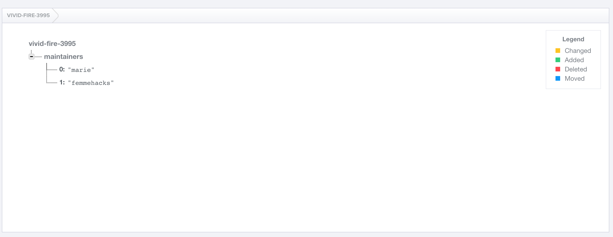
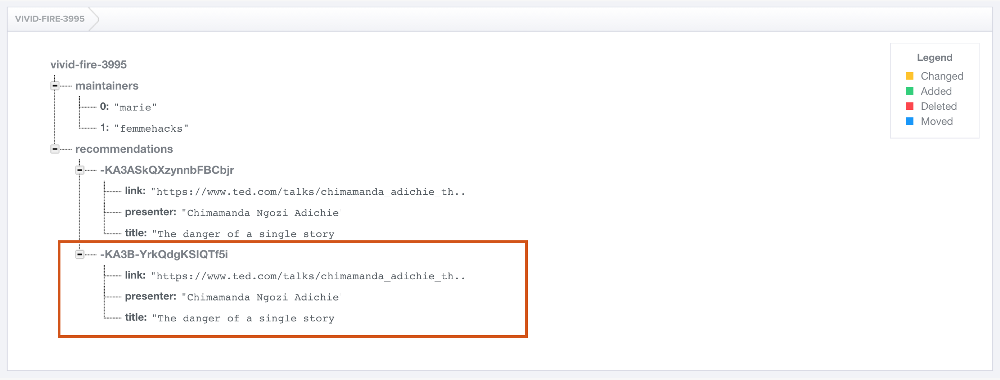
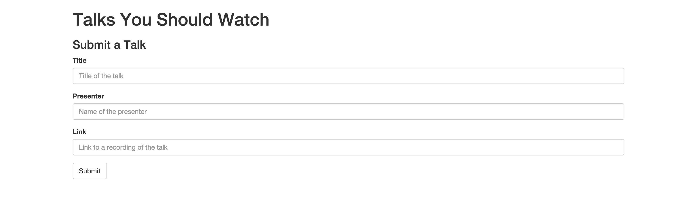
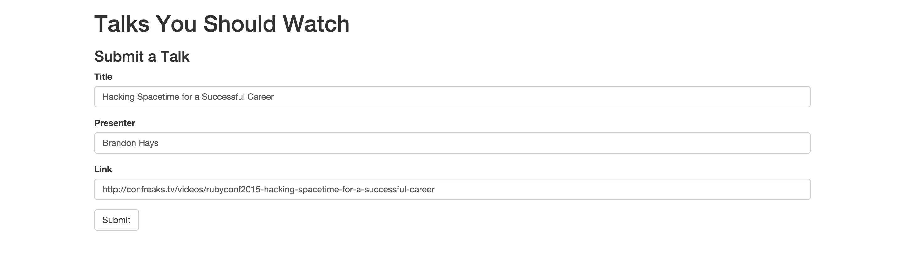
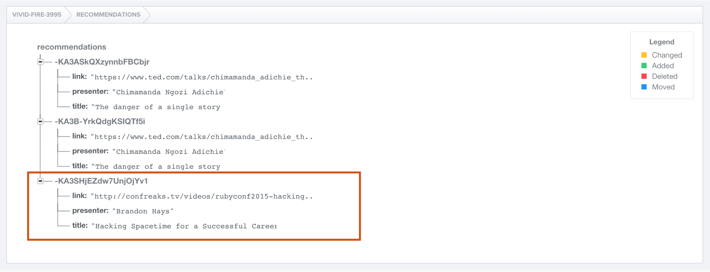

# Firebase Tutorial

## Table of Contents

* [Sign up for a Firebase account](#sign-up-for-a-firebase-account)
* [Check out your first app](#check-out-your-first-app)
* [Write some data manually in the Firebase Dashboard](#write-some-data-manually-in-the-firebase-dashboard)
* [Write some hard-coded data via the Javascript Library
](#write-some-hard-coded-data-via-the-javascript-library)
* [Write some user-provided data](#write-some-user-provided-data)
* [Read some user-provided data](#read-some-user-provided-data)
* [Advanced topics in data wizardry](#advanced-topics-in-data-wizardry)

**PAUSE POINT:** [What is a backend and why do I need one?](../explanations/backend.md)

## Sign up for a Firebase account

Go to the [Firebase website](https://www.firebase.com/account) and sign up for an account if you don't already have one. You can log in with a Google account for easy access.

## Check out your first app

A simple database is first created for you when you make a new account. It's named **MY FIRST APP**, and you can start using it right away!


Note the unique URL assigned to your app — it probably looks something like **[adjective]-fire-[number].firebase.io**. This is your **Firebase URL** and it's pretty important. It describes where to find all the data for this app.

## Write some data manually in the Firebase Dashboard

Check out your database by clicking on the box, or by navigating to **[your-firebase-app].firebase.io** in your browser.

Right now, your database is pretty empty. All it contains is a reference to your database (**your-firebase-app**), which points to a null (empty) object.


Everything in Firebase is organized in a hierarchy under this starting reference, as a single JSON object. A helpful way to think of your Firebase database is as a single object, with other objects nested inside it.

**PAUSE POINT:** [What is JSON?](../explanations/json.md)

Let's add some data. For now, we just want to keep track of who is maintaining this database. We can think of this as an array of names:



```json
"maintainers": [
    "marie",
    "femmehacks"
]
```

`maintainers` is the name of our array. It belongs at the top level of our database, as a key of **your-firebase-app**. We can manually add this list in the Firebase Dashboard by pressing the green plus next to **your-firebase-app**.



Once we save, we can see that the maintainers list is now in our database!



We can edit, add, or delete data from Dashboard. Be careful once you populate your Dashboard with real data though! You don't want to accidentally ruin or delete the data that makes your application useful to users.

## Write some hard-coded data via the Javascript Library

For our app, we want to collect a list of talks to watch. For each recommendation we want to collect:

* Title of the talk
* Name of the presenter
* Link to video recording of the talk

We probably want to assign each recommendation a unique ID so that we can keep track of it. Here's what a recommendation object might look like in our Firebase database:


If we wanted to represent a particular talk recommendation as a JSON object, we could write:

```json
{
    "title": "The danger of a single story",
    "presenter": "Chimamanda Ngozi Adichie",
    "link": "https://www.ted.com/talks/chimamanda_adichie_the_danger_of_a_single_story"
}
```

Okay but how do we get that into our Firebase database? Let's go ahead and make a super simple website. Our website will consist of a single page of HTML, which runs exactly two Javascript files. One of those files is the [Javascript library](https://www.firebase.com/docs/web/), which Firebase provides to abstract away a lot of the work of making requests to the database.

So this is not going to be pretty, but our page will write data to our Firebase.

In your text editor of choice, make two files and save them in the same folder:

####[application.html](code_samples/v1/application.html)
```html
<html>
  <head>
    <!-- Load the Firebase library before loading the body. -->
    <script src="https://cdn.firebase.com/js/client/2.4.0/firebase.js"></script>
  </head>

  <body>
    <!-- Load the application script, which will save data to our Firebase app. -->
    <script src="application.js"></script>

    <!-- Honestly, we don't need this but otherwise this page is totally blank and it's kind of hard to tell that it's already loaded. -->
    <h1>Hello world!</h1>
  </body>
</html>
```

####[application.js](code_samples/v1/application.js)
```javascript
// TODO: Replace with your Firebase app
var myFirebaseApp = "REPLACE-ME-WITH-YOUR-FIREBASE-APP-NAME";

// Reference to your entire Firebase database
var myFirebase = new Firebase("https://" + myFirebaseApp + ".firebaseio.com/");

// Get a reference to the recommendations object of your Firebase.
// Note: this doesn't exist yet. But when we write to our Firebase using
// this reference, it will create this object for us!
var recommendations = myFirebase.child("recommendations");

// Push our first recommendation to the end of the list and assign it a
// unique ID automatically.
recommendations.push({
    "title": "The danger of a single story",
    "presenter": "Chimamanda Ngozi Adichie",
    "link": "https://www.ted.com/talks/chimamanda_adichie_the_danger_of_a_single_story"
});
```

Open **application.html** in any internet browser. You should see something that looks like this:


Seems pretty boring. But go check your Firebase Dashboard.


There's data there! That you added! From a page on your computer!

And it added a really funky string thing. That's the unique URL of the recommendation object we just added. So if we wanted to reference that object, we could do something like:

```javascript
var myFirstRecommendation = new Firebase("https://REPLACE-ME-WITH-YOUR-FIREBASE-APP-NAME.firebaseio.com/recommendations/-KA3ASkQXzynnbFBCbjr");
```

And if we navigate to that page in our browser, we can see that object in our Dashboard.


Let's take a second to stop here: you just wrote data to a database in the cloud. **That's so legit.** If you've never done that before, go tweet about it or something.

## Write some user-provided data

What happens if you refresh **application.html** in your browser?



It adds the exact same object to your Firebase! Again. That's kind of cool. But it's also a bit pointless.

We can keep refreshing this page forever but it's just going to keep adding the exact same recommendation to our database over and over again. We probably want users to be able to give us some data. So let's make a form!

**PAUSE POINT:** [What is asynchronous code execution and how do Javascript promises work?](../explanations/asynchronous_promises.md)

####[application.html](code_samples/v2/application.html)
```html
<html>
  <head>
    <!-- Load the Firebase library before loading the body. -->
    <script src="https://cdn.firebase.com/js/client/2.4.0/firebase.js"></script>

    <!-- Load the jQuery library, which we'll use to manipulate HTML elements with Javascript. -->
    <script src="https://code.jquery.com/jquery-2.2.0.min.js"></script>

    <!-- Load Bootstrap stylesheet, which will is CSS that makes everything prettier and also responsive (aka will work on all devices of all sizes). -->
    <link rel="stylesheet" href="https://maxcdn.bootstrapcdn.com/bootstrap/3.3.6/css/bootstrap.min.css" integrity="sha384-1q8mTJOASx8j1Au+a5WDVnPi2lkFfwwEAa8hDDdjZlpLegxhjVME1fgjWPGmkzs7" crossorigin="anonymous">
  </head>

  <body>
    <!-- Load the application script, which will save data to our Firebase app when we click the button. -->
    <script src="application.js"></script>

    <div class="container">
      <h1>Talks You Should Watch</h1>

      <h3>Submit a Talk</h3>

      <form id="recommendationForm">
        <div class="form-group">
          <label for="talkTitle">Title</label>
          <input class="form-control" id="talkTitle" placeholder="Title of the talk">
        </div>

        <div class="form-group">
          <label for="talkPresenter">Presenter</label>
          <input class="form-control" id="talkPresenter" placeholder="Name of the presenter">
        </div>

        <div class="form-group">
          <label for="talkLink">Link</label>
          <input type="url" class="form-control" id="talkLink" placeholder="Link to a recording of the talk">
        </div>

        <!-- When you click this button, trigger the submit event on this form. -->
        <button type="submit" class="btn btn-default">Submit</button>
      </form>
    </div>
  </body>
</html>
```

####[application.js](code_samples/v2/application.js)
```javascript
// TODO: Replace with your Firebase app
var myFirebaseApp = "REPLACE-ME-WITH-YOUR-FIREBASE-APP-NAME";

// Reference to the recommendations object in your Firebase
var recommendations = new Firebase("https://" + myFirebaseApp + ".firebaseio.com/recommendations");

// Save a new recommendation to the database, using the input in the form
var submitRecommendation = function () {

  // Get input values from each of the form elements
  var title = $("#talkTitle").val();
  var presenter = $("#talkPresenter").val();
  var link = $("#talkLink").val();

  // Push a new recommendation to the database using those values
  recommendations.push({
    "title": title,
    "presenter": presenter,
    "link": link
  });
};

// When the window is fully loaded, call this function.
// Note: because we are attaching an event listener to a particular HTML element
// in this function, we can't do that until the HTML element in question has
// been loaded. Otherwise, we're attaching our listener to nothing, and no code
// will run when the submit button is clicked.
$(window).load(function () {

  // Find the HTML element with the id recommendationForm, and when the submit
  // event is triggered on that element, call submitRecommendation.
  $("#recommendationForm").submit(submitRecommendation);

});
```

Refresh **application.html** again. This time, it shouldn't auto-save any data to your Firebase. What you'll see looks a lot prettier, thanks to Bootstrap.



Go ahead and fill out the form. You'll notice that Bootstrap does some cool magic and will give you an error if you try to submit the form without giving a proper URL for the link input.



When you submit the form, it should clear all the fields, and save your user-provided data to your Firebase!



## Read some user-provided data

Writing data is pretty cool, but users probably also want to read some of the data they're writing. Let's show them the most recent recommendation — and let's have it auto-refresh for them. REALTIME. MAGIC.

####[application.html](code_samples/v3/application.html)
```html
<html>
  <head>
    <!-- Load the Firebase library before loading the body. -->
    <script src="https://cdn.firebase.com/js/client/2.4.0/firebase.js"></script>

    <!-- Load the jQuery library, which we'll use to manipulate HTML elements with Javascript. -->
    <script src="https://code.jquery.com/jquery-2.2.0.min.js"></script>

    <!-- Load Bootstrap stylesheet, which will is CSS that makes everything prettier and also responsive (aka will work on all devices of all sizes). -->
    <link rel="stylesheet" href="https://maxcdn.bootstrapcdn.com/bootstrap/3.3.6/css/bootstrap.min.css" integrity="sha384-1q8mTJOASx8j1Au+a5WDVnPi2lkFfwwEAa8hDDdjZlpLegxhjVME1fgjWPGmkzs7" crossorigin="anonymous">
  </head>

  <body>
    <!-- Load the application script, which will save data to our Firebase app when we click the button. -->
    <script src="application.js"></script>

    <div class="container">
      <h1>Talks You Should Watch</h1>

      <h3>Last Talk Proposed</h3>

      <table class="table table-striped">
        <thead>
          <tr>
            <th>Title</th>
            <th>Presenter</th>
            <th>Link</th>
          </tr>
        </thead>
        <tbody>
          <tr>
            <!-- This is empty for now, but it will be filled out by an event handler in application.js with the most recent recommendation data from Firebase. -->
            <td id="title"></td>
            <td id="presenter"></td>
            <td><a id="link" target="_blank"></a></td>
          </tr>
        </tbody>
      </table>

      <h3>Submit a Talk</h3>

      <form id="recommendationForm">
        <div class="form-group">
          <label for="talkTitle">Title</label>
          <input class="form-control" id="talkTitle" placeholder="Title of the talk">
        </div>

        <div class="form-group">
          <label for="talkPresenter">Presenter</label>
          <input class="form-control" id="talkPresenter" placeholder="Name of the presenter">
        </div>

        <div class="form-group">
          <label for="talkLink">Link</label>
          <input type="url" class="form-control" id="talkLink" placeholder="Link to a recording of the talk">
        </div>

        <!-- When you click this button, trigger the submit event on this form. -->
        <button type="submit" class="btn btn-default">Submit</button>
      </form>
    </div>
  </body>
</html>
```

####[application.js](code_samples/v3/application.js)
```javascript
// TODO: Replace with your Firebase app
var myFirebaseApp = "REPLACE-ME-WITH-YOUR-FIREBASE-APP-NAME";

// Reference to the recommendations object in your Firebase
var recommendations = new Firebase("https://" + myFirebaseApp + ".firebaseio.com/recommendations");

// Save a new recommendation to the database, using the input in the form
var submitRecommendation = function () {

  // Get input values from each of the form elements
  var title = $("#talkTitle").val();
  var presenter = $("#talkPresenter").val();
  var link = $("#talkLink").val();

  // Push a new recommendation to the database using those values
  recommendations.push({
    "title": title,
    "presenter": presenter,
    "link": link
  });
};

// Get the single most recent recommendation from the database and
// update the table with its values. This is called every time the child_added
// event is triggered on the recommendations Firebase reference, which means
// that this will update EVEN IF you don't refresh the page. Magic.
recommendations.limitToLast(1).on('child_added', function(childSnapshot) {
  // Get the recommendation data from the most recent snapshot of data
  // added to the recommendations list in Firebase
  recommendation = childSnapshot.val();

  // Update the HTML to display the recommendation text
  $("#title").html(recommendation.title)
  $("#presenter").html(recommendation.presenter)
  $("#link").html(recommendation.link)

  // Make the link actually work and direct to the URL provided
  $("#link").attr("href", recommendation.link)
});

// When the window is fully loaded, call this function.
// Note: because we are attaching an event listener to a particular HTML element
// in this function, we can't do that until the HTML element in question has
// been loaded. Otherwise, we're attaching our listener to nothing, and no code
// will run when the submit button is clicked.
$(window).load(function () {

  // Find the HTML element with the id recommendationForm, and when the submit
  // event is triggered on that element, call submitRecommendation.
  $("#recommendationForm").submit(submitRecommendation);

});
```

When you reload **application.html**, it should look something like this.


It should go ahead and read the last recommendation that you saved to your Firebase. But what happens if you add another recommendation?


IT REFRESHES! And shows that one. Open **application.html** in another window and submit another recommendation there. Watch the original window – it should update automatically!


Look at that wizardry. You are a data magician already.

## Advanced topics in data wizardry

You've got a simple website, and it reads and writes data! To the cloud!

That's pretty legit. But there's some more stuff you should probably do.

**Wait a second, what's preventing anyone from writing and reading all the data in my database? Or deleting it? Or keeping random stuff in my database that doesn't have anything to do with talk recommendations?**

Nothing. You're right to be concerned about that. You should probably add some security rules. Read the [Security docs](https://www.firebase.com/docs/security/) on Firebase to learn how to limit access to your database, and validate that requests are sending the right kind of data.

**What if I want people to be able to log in to my website/app? Can I have users?**

Yes, you can! Firebase makes it very easy for you to add users. They can log in via email/password, or by authenticating with Google/Facebook/Twitter/GitHub. You can also have anonymous user sessions! Learn more in the [Users docs](https://www.firebase.com/docs/web/guide/user-auth.html). If you're security minded, you can even use your Users data to prevent someone from seeing data that isn't theirs while using your app.

**Okay so this works on my machine, but how do I share this with other people?**

You'll want to host your static assets (i.e. your HTML/Javascript/CSS/images) somewhere, and give people a URL to that place. If you don't already have a hosting platform, you can host your website with Firebase. Check out the [Hosting docs](https://www.firebase.com/docs/hosting/) for more information.

**Websites are so 2000. I want to make an iOS/Android app. Can I still use Firebase?**

Yeah you can! Although all of these examples use Firebase's [Javascript library](https://www.firebase.com/docs/web/), they also provide an [iOS library](https://www.firebase.com/docs/ios/) and an [Android library](https://www.firebase.com/docs/android/).

**What if I'm not writing in Javascript, or for iOS or Android?**

Those libraries are built to abstract away the details of Firebase's REST API. You can use the API directly by sending HTTP requests to Firebase endpoints directly. Learn more in the [REST docs](https://www.firebase.com/docs/rest/). There are some helpful third-party libraries already provided for common languages like Python and Ruby, but you can also write the requests yourself if you're working in a different language or you want an extra challenge.