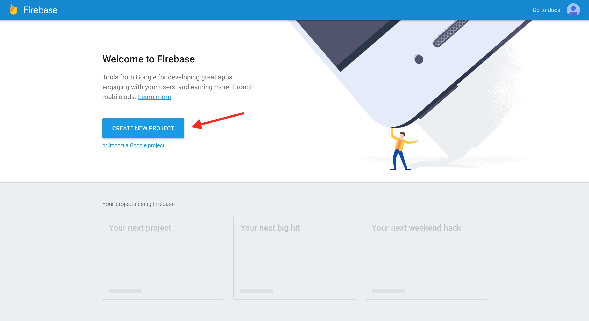
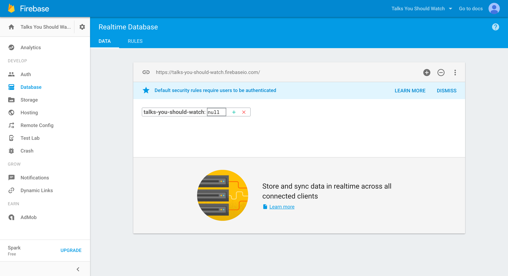
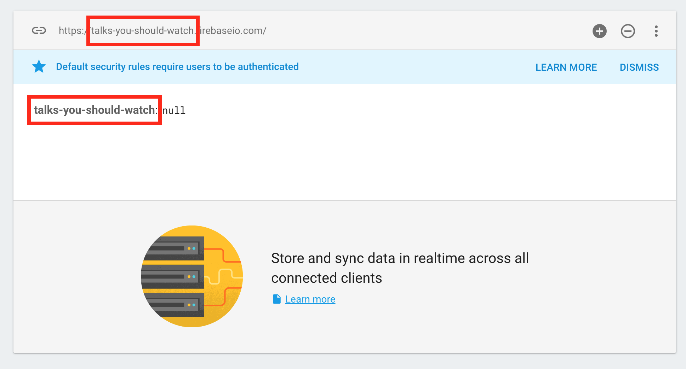

# Step 1: Setup your first Firebase application

## BEFORE

|  | [What is a backend and why do I need one?](../../explanations/backend.md) |
| --- | --- | 

## DURING

Go to the [Firebase website](https://firebase.google.com/) and sign up for an account if you don't already have one. You can log in with a Google account for easy access.

When you log in, you should be directed to the Firebase console. You can manage all of your projects here. Go ahead and create a new one by clicking the blue **CREATE NEW PROJECT** button.

Give your new project a name.

Once you create your project, you'll be redirected to your project's console overview. If you check the URL at the top of your browser, you'll see something like __https://console.firebase.google.com/project/talks-you-should-watch/overview__, where the part of the URL after **/project/** matches your project's name.

We'll refer to that part of the URL as your **Project ID**. So the project in the screen shots here is named **Talks You Should Watch** and its Project ID is **talks-you-should-watch**.

This is where you can come to manage your project. Feel free to explore a bit but when you're ready to continue with the tutorial, navigate to the **Database** tab. You should see something like this:

Notice that your Project ID appears in a few places here. There's a URL that looks something like **your-project-id.firebase.io**. This is your **Firebase URL** and it's pretty important. It describes where to find all the data for this app.

### EXTRA CREDIT

1. Change your application's public facing name or project ID. (Hint: you can do this from the settings page for your project.)
2. Click around your project's overview page and learn more about what you can do from this page.

## AFTER

You created a Firebase account and your first Firebase project.

You know **your-project-id**, which uniquely describes your project. You can access your project's Database console at __https://console.firebase.google.com/project/your-project-id/database/data__.

**Step 2:** [Write data manually in the Firebase Dashboard](step2_write_data_manually.md)