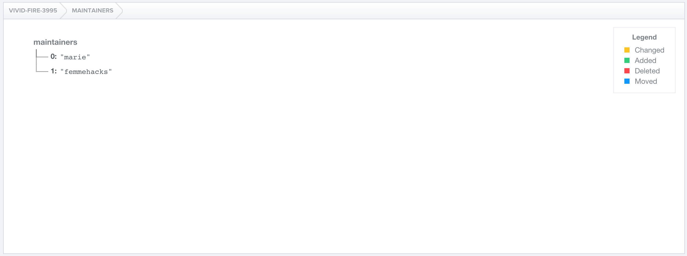

# Step 2: Write some data manually in the Firebase Dashboard

## BEFORE

| You should... | What to Review |
|------------|--------|
| ...be looking at your database's Dashboard.| [Step 1](step1_setup.md) |
| ...know **your-firebase-app**, the unique description of your database.| [Step 1](step1_setup.md) |

## DURING

Right now, your database is pretty empty. All it contains is a reference to your database (**your-firebase-app**), which points to a null (empty) object.


Everything in Firebase is organized in a hierarchy under this starting reference, as a single JSON object. A helpful way to think of your Firebase database is as a single object, with other objects nested inside it.

|  | [What is JSON?](../../explanations/json.md) |
| --- | --- |

Let's add some data. For now, we just want to keep track of who is maintaining this database. We can think of this as an array of names:


```json
"maintainers": [
    "marie",
    "femmehacks"
]
```

`maintainers` is the name of our array. It belongs at the top level of our database, as a key of **your-firebase-app**. We can manually add this list in the Firebase Dashboard by pressing the green plus next to **your-firebase-app**.

Don't see the green plus? You may need to hover your mouse over **your-firebase-app** to make the edit box appear.


For **name**, add the key: ```maintainers```
For **value**, add the entire value object: ```["marie", "femmehacks"]``` 

Once we save, we can see that the maintainers list is now in our database! The box might show up with a green highlight at first, indicating that the data has just been added.


If you click on **maintainers**, you should be directed to **your-firebase-app.firebase.io/maintainers**.



Instead of seeing the entire database, this Dashboard allows us to inspect only the **maintainers** object of our database, and any nested data.

### EXTRA CREDIT

1. Add another name to the **maintainers** array
2. Edit a name in the **maintainers** array
3. Delete a name from the **maintainers** array
4. Add another object to the top level of **your-firebase-app**
5. Figure out what URL you would need to create to link directly to one of the names in the **maintainers** array

## AFTER

You can edit, add, or delete data manually from your database's Dashboard. 

You can link directly to a nested object in your database.

*Be careful manipulating data through Dashboard once you populate your database with real data!* You don't want to accidentally ruin or delete the data that makes your application useful to users.

**Step 3:** [Write some hard-coded data via the Javascript Library](step3_write_hard_coded_data.md)
